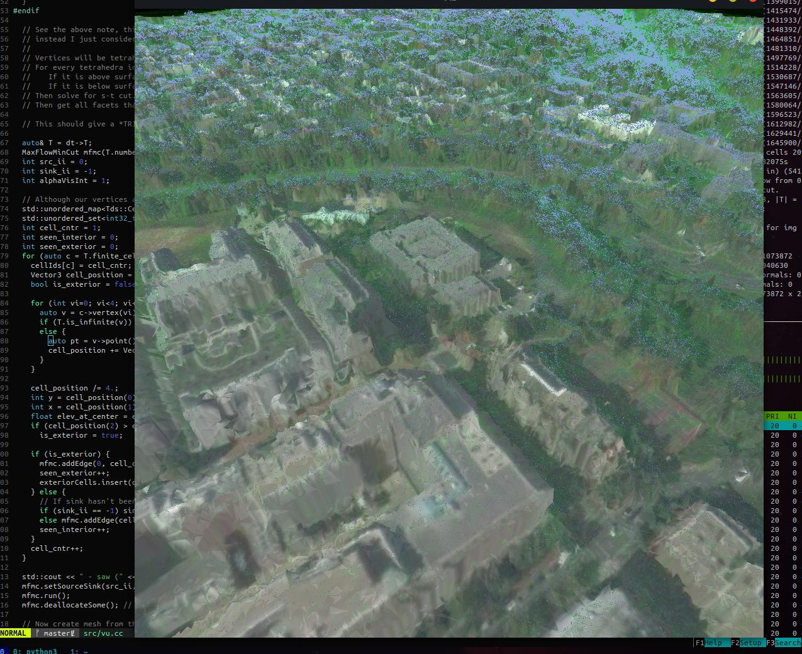

# MeshedUp

An attempt to use USGS lidar and NAIP imagery to create textured meshes. I am more focused on the reconstruction algorithms and experimentation then getting anything operational. But I plan to work on mesh simplification and converting to glTF/3d-tiles later.

## Approaches
1.  [Vu et. al](http://islab.ulsan.ac.kr/files/announcement/441/PAMI-2012%20High%20Accuracy%20and%20Visibility-Consistent%20Dense%20Multiview%20Stereo.pdf). To draw an analogy with that paper, here we have only one camera, and it is orthographic, and it is looking straight down. So a tetrahedron is 'inside' if it lies below a 2d terrain map. The min s-t cut here is trivial, but I plan on adding more terms later, and so I worked on the code to carry it out.

2. The first thing I tried was running Marching Cubes on an Octree where each cell had a value of 1 if it contained a point, else 0. That had a lot of holes. I tried using evaluating and meshing an RBF for all cells 2-3 levels above the max depth, but it still had holes. The next thing I'd try here is forgoing the RBF, and just filling *every* cell that lies below a 2d terrain map, then just meshing the cells with marching cubes. Also, 'surface following' methods would probably work better here than MC (which is what a few RBF techniques I've seen do).

3. Direct 2.5d meshing. Basically I just build a terrain map and add vertices wherever the value changes. However, the raw terrain map has blurry edges and missing data, so I formulate a CRF to fix those two problems. Every pixel in the elevation map is labelled one of nine labels, which assign it to one of its 8 neighbors or its original value. The data term penalizes the original to the assigned values, and the smoothness term penalizes changes. After this a second CRF is used to predict a mask of where its okay to have discontinuities (i.e. create two vertices for one pixel, one above the other).

## Etc.

In order to create a terrain map, it is very convenient to use pytorch sparse tensors. You can create two sparse tensors that share the same coordinates, but as values, one has the data to be averaged-per-cell and the other has value=1. The latter will act as the counter for each cell to divide the 'aggregated()' values over.
The USGS Lidar contains some empty cells if using an even moderate resolution, so a median filter afterward helps.

I use libMRF for the energy model minimization [[1]](#1) [[2]](#2) [[3]](#3). Particularly, I use the alpha-expansion algorithm.

## References
<a id="1">[1]</a> Fast Approximate Energy Minimization via Graph Cuts.
Y. Boykov, O. Veksler, and R. Zabih.
In IEEE Transactions on Pattern Analysis and Machine Intelligence
(PAMI), vol. 23, no. 11, pages 1222-1239, November 2001.  

<a id="2">[2]</a> What Energy Functions can be Minimized via Graph Cuts?
V. Kolmogorov and R. Zabih. 
In IEEE Transactions on Pattern Analysis and Machine Intelligence
(PAMI), vol. 26, no. 2, pages 147-159, February 2004. 
An earlier version appeared in European Conference on Computer
Vision (ECCV), May 2002.

<a id="3">[3]</a> An Experimental Comparison of Min-Cut/Max-Flow Algorithms for
Energy Minimization in Vision. 
Y. Boykov and Vladimir Kolmogorov.
In IEEE Transactions on Pattern Analysis and Machine Intelligence
(PAMI), vol. 26, no. 9, pages 1124-1137, September 2004. 
