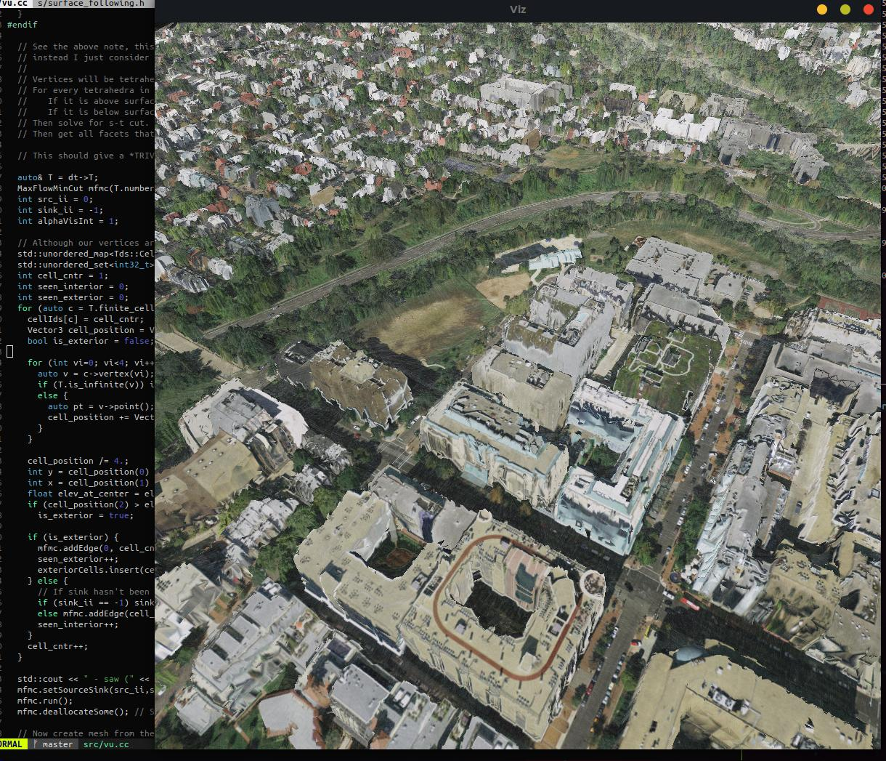

# MeshedUp

An attempt to use USGS lidar and NAIP imagery to create textured meshes. I am more focused on the reconstruction algorithms and experimentation then getting anything operational. But I plan to work on mesh simplification and converting to glTF/3d-tiles later.

After reading a few papers and attempting a few techniques, I settled on an Delaunay Tetrahedrialization-based approach similar to [Vu et. al](http://islab.ulsan.ac.kr/files/announcement/441/PAMI-2012%20High%20Accuracy%20and%20Visibility-Consistent%20Dense%20Multiview%20Stereo.pdf). To draw an analogy with that paper, here we have only one camera, and it is orthographic, and it is looking straight down. So a tetrahedron is 'inside' if it lies below a 2d terrain map. The min s-t cut here is trivial, but I plan on adding more terms later, and so I worked on the code to carry it out.

The first thing I tried was running Marching Cubes on an Octree where each cell had a value of 1 if it contained a point, else 0. That had a lot of holes. I tried using evaluating and meshing an RBF for all cells 2-3 levels above the max depth, but it still had holes. The next thing I'd try here is forgoing the RBF, and just filling *every* cell that lies below a 2d terrain map, then just meshing the cells with marching cubes. Also, 'surface following' methods would probably work better here than MC (which is what a few RBF techniques I've seen do).

In order to create a terrain map, it is very convenient to use pytorch sparse tensors. You can create two sparse tensors that share the same coordinates, but as values, one has the data to be averaged-per-cell and the other has value=1. The latter will act as the counter for each cell to divide the 'aggregated()' values over.
The USGS Lidar contains some empty cells if using an even moderate resolution, so a median filter afterward helps.
